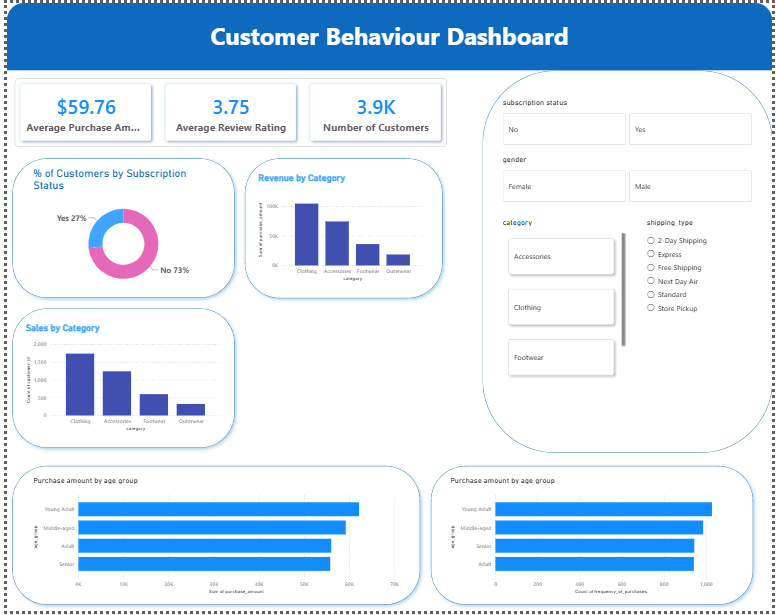

# Customer Shopping Behavior Analysis

An end-to-end data analytics project analyzing customer shopping patterns and purchasing behavior using **Python, MySQL, and Power BI**.

## Project Pipeline

**Raw Dataset → Python (Cleaning & EDA) → MySQL (Data Storage & Analysis) → Power BI (Visualization & Dashboard)**

## Objective

The objective of this project is to analyze customer purchasing behavior and identify patterns related to demographics, product categories, spending, subscriptions, discounts, seasons, payment methods, and purchase frequency.

## Dataset

The dataset contains **3,900 customer records and 18 attributes**, including:

* Customer demographics
* Products and categories
* Purchase amounts
* Customer locations
* Review ratings
* Subscription status
* Discounts and promotional codes
* Previous purchases
* Payment methods
* Purchase frequency

## Tools & Technologies

* **Python** — Pandas, NumPy, Matplotlib for data cleaning and exploratory analysis
* **MySQL** — Data storage and SQL-based business analysis
* **Power BI** — Data visualization and interactive dashboard creation
* **Jupyter Notebook** — Python analysis and documentation

## Workflow

1. Import and inspect the raw customer shopping dataset.
2. Clean and transform the data using Python.
3. Perform exploratory data analysis to understand customer behavior.
4. Load the processed dataset into MySQL.
5. Use SQL queries to answer business questions.
6. Connect the analyzed data to Power BI.
7. Build an interactive dashboard to communicate key insights.

## Key Analysis Areas

The project investigates customer spending patterns, product-category performance, demographic differences, subscription behavior, seasonal purchasing trends, discount usage, payment preferences, customer ratings, and purchase frequency.

## Dashboard

The Power BI dashboard presents important KPIs and customer behavior trends in an interactive format.

## Repository Structure

* `data/` — Raw/processed dataset
* `notebooks/` — Python data cleaning and EDA
* `sql/` — Database setup and analytical SQL queries
* `powerbi/` — Power BI dashboard file
* `images/` — Dashboard screenshots

## Skills Demonstrated

**Python | Pandas | Data Cleaning | EDA | MySQL | SQL | Power BI | Data Visualization | Business Analytics**
